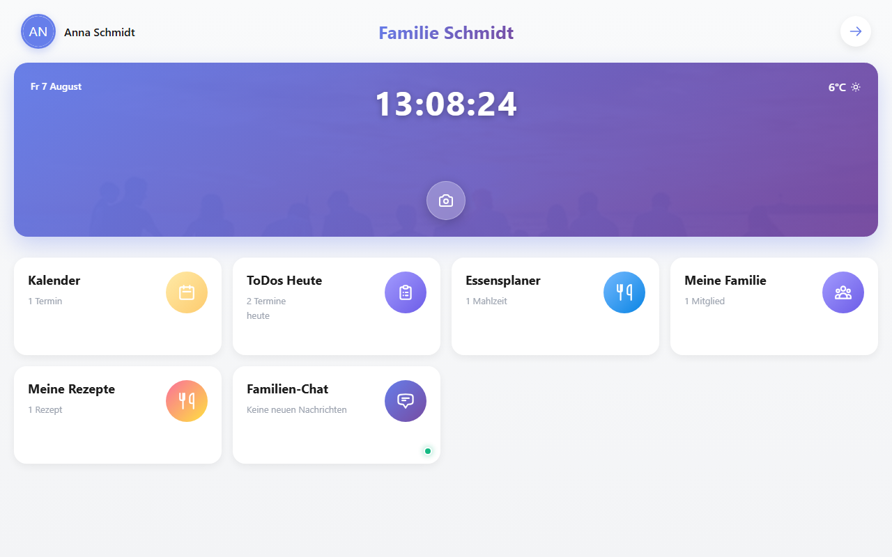

# HouseHoldPlanner

[](https://github.com/lukislp/HouseHoldPlanner/actions/workflows/ci-cd.yml)
[](https://github.com/lukislp/HouseHoldPlanner/releases)
[](LICENSE)
[](https://dotnet.microsoft.com/)

A self-hosted household management application built with Blazor WebAssembly and ASP.NET Core (.NET 10). Designed for families and shared households to coordinate tasks, meals, recipes, calendars, shopping lists, and real-time chat -- all in one place.

*Project and namespace names in the codebase (`HaushaltsPlaner.*`) predate the public repo name and are unchanged.*



## Features

- **Dashboard** -- overview card grid with live stats for all household modules
- **To-do lists** -- shared task lists with assignment and completion tracking
- **Meal planner** -- weekly calendar with lunch and dinner slots, linked to the recipe library
- **Recipe library** -- full CRUD for household recipes including ingredients, preparation steps, categories, servings, and prep/cook times; supports recipe import
- **Calendar** -- shared event calendar with recurrence rules, attendees, and location
- **Family management** -- invite members via email link, assign roles (Admin, Parent, Child, Guest), remove members
- **Real-time chat** -- household group chat powered by SignalR
- **Profile** -- avatar upload, display name and email editing
- **Internationalization** -- language auto-detected from the browser (`navigator.language`); ships with `de` and `en`; adding a language requires only a new JSON file
- **JWT authentication** -- stateless token-based auth with BCrypt password hashing
- **Docker-ready** -- two-container setup (API + nginx), named volume for persistent SQLite storage

## Stack

| | |
|---|---|
| Frontend | Blazor WebAssembly, .NET 10 |
| Backend | ASP.NET Core Web API, .NET 10 |
| Real-time | SignalR (`ChatHub`) |
| Database | SQLite via EF Core |
| Auth | JWT Bearer + BCrypt.Net |
| Styling | Custom scoped CSS, Bootstrap 5 |
| i18n | Singleton `TranslationStore` (JSON files) + scoped `I18nService` |
| Reverse proxy | nginx (client container) |

## Project Structure

```
HaushaltsPlaner.Client/                  # Blazor WebAssembly frontend
  Pages/
    Home.razor                           # Dashboard with stats cards
    Lists.razor                          # To-do lists
    Meals.razor                          # Weekly meal planner
    Recipes.razor                        # Recipe library
    Calendar.razor                       # Shared calendar
    Family.razor                         # Family/household management
    Chat.razor                           # Real-time group chat
    Profile.razor                        # User profile
    Login.razor
    Register.razor
  Components/
    Icon.razor                           # Inline SVG icon component
    LanguageProvider.razor               # JS interop: reads navigator.language
  Layout/
    MainLayout.razor
    EmptyLayout.razor                    # Used for login/register
  Services/
    TranslationStore.cs                  # Singleton: loads i18n/*.json at startup
    I18nService.cs                       # Scoped: language state, Get(key), OnLanguageChanged
    AuthenticationService.cs
    CalendarService.cs
    ChatService.cs
    FamilyService.cs
    HomeService.cs
    MealPlanService.cs
    ProfileService.cs
    RecipeService.cs
    TodoService.cs
  LocalizedComponentBase.cs             # Abstract base: subscribes to OnLanguageChanged
  wwwroot/
    i18n/
      de.json  en.json
    css/

HaushaltsPlaner.Server/                  # ASP.NET Core Web API
  Data/
    AppDbContext.cs
  Services/
    AuthService.cs
    CalendarService.cs
    ChatService.cs
    ChatHub.cs                           # SignalR hub
    FamilyService.cs
    HomeService.cs
    MealPlanService.cs
    ProfileService.cs
    RecipeService.cs
    RecipeImportService.cs
    TodoService.cs
  Program.cs

HaushaltsPlaner.Shared/                  # Shared models and DTOs
  Models/
  DTOs/
```

## Running Locally

Requires the [.NET 10 SDK](https://dotnet.microsoft.com/download).

```bash
git clone https://github.com/lukislp/HouseHoldPlanner.git
cd HouseHoldPlanner
```

Set a JWT signing key (required -- the server refuses to start without one):

```bash
export Jwt__Key="$(openssl rand -base64 32)"
```

Start the API server:

```bash
dotnet run --project HaushaltsPlaner.Server/HaushaltsPlaner.Server.csproj
```

Start the Blazor WebAssembly client (in a second terminal):

```bash
dotnet run --project HaushaltsPlaner.Client/HaushaltsPlaner.Client.csproj
```

The client is served at `http://localhost:5001` by default. The API listens on port `5242`.

The SQLite database is created automatically at startup -- no migrations need to be run manually.

Override the database path via environment variable:

```bash
ConnectionStrings__DefaultConnection="Data Source=/custom/path/haushaltsplaner.db" dotnet run --project HaushaltsPlaner.Server/HaushaltsPlaner.Server.csproj
```

## Docker

```bash
cp .env.example .env
# edit .env and set JWT_KEY (see the comment in the file for how to generate one)
docker compose up -d
```

The setup runs two containers:

| Container | Description | Port |
|---|---|---|
| `server` | ASP.NET Core API | internal (5242) |
| `client` | nginx serving the WASM bundle | `5004:80` |

The database is stored in a named volume mounted at `/app/data` inside the server container.

```yaml
# docker-compose.yml
services:
  server:
    build:
      context: .
      dockerfile: HaushaltsPlaner.Server/Dockerfile
    environment:
      - ASPNETCORE_URLS=http://+:5242
      - ASPNETCORE_ENVIRONMENT=Production
      - ConnectionStrings__DefaultConnection=Data Source=/app/data/haushaltsplaner.db
      - Jwt__Key=${JWT_KEY:?JWT_KEY must be set in .env - see .env.example}
    volumes:
      - db-data:/app/data
    restart: unless-stopped

  client:
    build:
      context: .
      dockerfile: HaushaltsPlaner.Client/Dockerfile
    ports:
      - "5004:80"
    depends_on:
      - server
    restart: unless-stopped

volumes:
  db-data:
```

Build images manually:

```bash
docker build -f HaushaltsPlaner.Server/Dockerfile -t haushaltsplaner-server .
docker build -f HaushaltsPlaner.Client/Dockerfile -t haushaltsplaner-client .
```

## Adding a Language

Drop a new JSON file into `HaushaltsPlaner.Client/wwwroot/i18n/`:

```json
// wwwroot/i18n/fr.json
{
  "Common_Save": "Enregistrer",
  "Common_Cancel": "Annuler"
}
```

`TranslationStore` picks it up on the next application start. Keys missing from the new file fall back to English automatically.

## Internationalization

Language is detected from `navigator.language` via JS interop after the WASM runtime initialises (`LanguageProvider.razor`). All components inherit from `LocalizedComponentBase`, which subscribes to `I18nService.OnLanguageChanged` and triggers a re-render automatically.

Use translations in any component:

```razor
@inherits LocalizedComponentBase

<h1>@I18n.Get("Home_Title")</h1>
<p>@I18n.Format("Family_Since", someDate.ToString("MMMM yyyy", CurrentCulture))</p>
```

`CurrentCulture` is a convenience property on `LocalizedComponentBase` that returns a `CultureInfo` matching the active language, used for locale-aware date formatting.

## Database

SQLite, schema managed via EF Core `EnsureCreatedAsync()` -- no migration files required. The database file is created at the path specified by `ConnectionStrings__DefaultConnection`.

Backup:

```bash
cp haushaltsplaner.db haushaltsplaner.db.bak
```

Reset by deleting the `.db` file and restarting the server -- a fresh database is created automatically.

## Troubleshooting

**API not reachable from the client** -- verify the `ServerUrl` entry in `HaushaltsPlaner.Client/wwwroot/appsettings.json` points to the correct server address and port.

**`UseHttpsRedirection` behind a reverse proxy** -- disable it in `Program.cs` when the proxy terminates TLS:

```csharp
// app.UseHttpsRedirection(); // not needed behind nginx / Nginx Proxy Manager
```

**WebSocket errors in chat** -- ensure the reverse proxy has WebSocket support enabled. In Nginx Proxy Manager, enable *Websockets Support* and add the upgrade headers in the Advanced tab.

**Database error on startup** -- the server process needs write access to the directory containing the `.db` file.

**Styles stale after update** -- hard reload (`Ctrl+Shift+R`). Scoped CSS is bundled by the build.

**Language not switching** -- `LanguageProvider` runs JS interop after the WASM runtime is ready, so there is a brief initial render before the browser language is applied. Both phases resolve to the nearest supported language or fall back to `en`.

## License

[AGPL-3.0](LICENSE) -- if you run a modified version of this app as a network service, you
must make your modified source available to its users.
